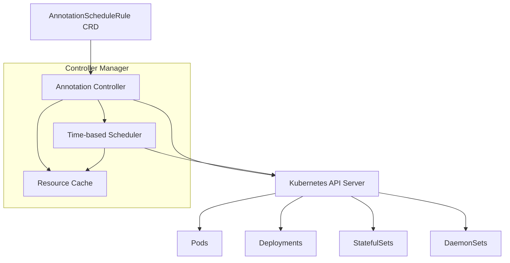

# Design Document

## Overview

The Dynamic Annotation Scheduler is implemented as a Kubernetes controller using the controller-runtime framework and Kubebuilder. The system consists of a Custom Resource Definition (CRD) for defining annotation scheduling rules, a controller that watches for changes and manages schedules, and a scheduler component that executes time-based operations.

The controller follows the standard Kubernetes controller pattern with reconciliation loops, event-driven updates, and declarative configuration management. It integrates with the Kubernetes API server to watch resources and apply annotations based on configurable scheduling rules.

## Architecture

### High-Level Components



### Controller Architecture

The system uses a multi-controller architecture:

1. **AnnotationScheduleRule Controller**: Manages the lifecycle of scheduling rules
2. **Resource Controller**: Watches target resources (Pods, Deployments, etc.) for changes
3. **Scheduler Component**: Handles time-based execution of annotation operations

## Components and Interfaces

### Custom Resource Definition

**AnnotationScheduleRule CRD Structure:**

```yaml
apiVersion: apiextensions.k8s.io/v1
kind: CustomResourceDefinition
metadata:
  name: annotationschedulerules.scheduler.k8s.io
spec:
  group: scheduler.k8s.io
  versions:
  - name: v1
    schema:
      openAPIV3Schema:
        type: object
        properties:
          spec:
            type: object
            properties:
              schedule:
                type: object
                oneOf:
                - properties:
                    type:
                      type: string
                      enum: ["datetime"]
                    startTime:
                      type: string
                      format: date-time
                    endTime:
                      type: string
                      format: date-time
                - properties:
                    type:
                      type: string
                      enum: ["cron"]
                    cronExpression:
                      type: string
                    action:
                      type: string
                      enum: ["apply", "remove"]
              selector:
                type: object
                properties:
                  matchLabels:
                    type: object
                  matchExpressions:
                    type: array
              annotations:
                type: object
                additionalProperties:
                  type: string
              targetResources:
                type: array
                items:
                  type: string
                  enum: ["pods", "deployments", "statefulsets", "daemonsets"]
          status:
            type: object
            properties:
              lastExecutionTime:
                type: string
                format: date-time
              nextExecutionTime:
                type: string
                format: date-time
              phase:
                type: string
                enum: ["pending", "active", "completed", "failed"]
              conditions:
                type: array
                items:
                  type: object
```

### Controller Interfaces

**Main Controller Interface:**

```go
type AnnotationScheduleRuleReconciler struct {
    client.Client
    Scheme    *runtime.Scheme
    Scheduler *TimeScheduler
    Log       logr.Logger
}

func (r *AnnotationScheduleRuleReconciler) Reconcile(ctx context.Context, req ctrl.Request) (ctrl.Result, error)
```

**Scheduler Interface:**

```go
type TimeScheduler interface {
    ScheduleRule(rule *schedulerv1.AnnotationScheduleRule) error
    UnscheduleRule(ruleID string) error
    Start(ctx context.Context) error
    Stop() error
}

type AnnotationApplier interface {
    ApplyAnnotations(ctx context.Context, selector metav1.LabelSelector, annotations map[string]string, targetTypes []string) error
    RemoveAnnotations(ctx context.Context, selector metav1.LabelSelector, annotationKeys []string, targetTypes []string) error
}
```

### Resource Management

**Resource Selector and Applier:**

```go
type ResourceManager struct {
    client.Client
    Log logr.Logger
}

func (rm *ResourceManager) GetMatchingResources(ctx context.Context, selector metav1.LabelSelector, resourceTypes []string) ([]client.Object, error)
func (rm *ResourceManager) ApplyAnnotationsToResource(ctx context.Context, obj client.Object, annotations map[string]string) error
func (rm *ResourceManager) RemoveAnnotationsFromResource(ctx context.Context, obj client.Object, keys []string) error
```

## Data Models

### Core Types

**AnnotationScheduleRule Spec:**

```go
type AnnotationScheduleRuleSpec struct {
    Schedule        ScheduleConfig            `json:"schedule"`
    Selector        metav1.LabelSelector      `json:"selector"`
    Annotations     map[string]string         `json:"annotations"`
    TargetResources []string                  `json:"targetResources"`
}

type ScheduleConfig struct {
    Type           string     `json:"type"` // "datetime" or "cron"
    StartTime      *metav1.Time `json:"startTime,omitempty"`
    EndTime        *metav1.Time `json:"endTime,omitempty"`
    CronExpression string     `json:"cronExpression,omitempty"`
    Action         string     `json:"action,omitempty"` // "apply" or "remove" for cron
}
```

**Status Tracking:**

```go
type AnnotationScheduleRuleStatus struct {
    LastExecutionTime  *metav1.Time `json:"lastExecutionTime,omitempty"`
    NextExecutionTime  *metav1.Time `json:"nextExecutionTime,omitempty"`
    Phase              string       `json:"phase"`
    Conditions         []metav1.Condition `json:"conditions,omitempty"`
    AffectedResources  int32        `json:"affectedResources,omitempty"`
}
```

### Schedule Management

**Internal Schedule Representation:**

```go
type ScheduledTask struct {
    RuleID      string
    RuleName    string
    Namespace   string
    Action      ScheduleAction
    ExecuteAt   time.Time
    Annotations map[string]string
    Selector    metav1.LabelSelector
    TargetTypes []string
}

type ScheduleAction string
const (
    ActionApply  ScheduleAction = "apply"
    ActionRemove ScheduleAction = "remove"
)
```

## Error Handling

### Error Categories and Responses

1. **Validation Errors**: Invalid CRD configurations
   - Response: Update status with validation error, do not schedule
   - Retry: Manual correction required

2. **Scheduling Errors**: Invalid time formats or cron expressions
   - Response: Log error, update status, mark rule as failed
   - Retry: Exponential backoff with max attempts

3. **Resource Access Errors**: API server connectivity, RBAC issues
   - Response: Retry with exponential backoff
   - Retry: Up to 5 attempts with 1s, 2s, 4s, 8s, 16s delays

4. **Resource Not Found**: Target resources deleted
   - Response: Log warning, continue processing other resources
   - Retry: No retry needed

### Error Recovery Strategies

```go
type ErrorHandler struct {
    maxRetries int
    baseDelay  time.Duration
}

func (eh *ErrorHandler) HandleError(err error, attempt int) (shouldRetry bool, delay time.Duration) {
    switch {
    case errors.IsNotFound(err):
        return false, 0
    case errors.IsConflict(err):
        return true, time.Duration(attempt) * eh.baseDelay
    case errors.IsServerTimeout(err):
        return true, time.Duration(1<<attempt) * eh.baseDelay
    default:
        return attempt < eh.maxRetries, time.Duration(1<<attempt) * eh.baseDelay
    }
}
```

## Testing Strategy

### Unit Testing

1. **Controller Logic Tests**
   - Test reconciliation logic with mock clients
   - Validate schedule parsing and validation
   - Test error handling scenarios

2. **Scheduler Component Tests**
   - Test cron expression parsing
   - Test datetime schedule calculations
   - Test task execution logic

3. **Resource Management Tests**
   - Test label selector matching
   - Test annotation application/removal
   - Test multi-resource type handling

### Integration Testing

1. **End-to-End Scenarios**
   - Create AnnotationScheduleRule and verify annotations are applied
   - Test schedule expiration and annotation removal
   - Test cron-based recurring operations

2. **Failure Scenarios**
   - Test controller restart and state recovery
   - Test API server connectivity issues
   - Test resource deletion during processing

### Test Environment Setup

```go
// Test suite setup using envtest
var testEnv *envtest.Environment
var k8sClient client.Client
var ctx context.Context
var cancel context.CancelFunc

func TestMain(m *testing.M) {
    testEnv = &envtest.Environment{
        CRDDirectoryPaths: []string{filepath.Join("..", "config", "crd", "bases")},
    }
    
    cfg, err := testEnv.Start()
    // Setup test client and run tests
}
```

### Performance Testing

1. **Scale Testing**
   - Test with 100+ AnnotationScheduleRules
   - Test with 1000+ target resources
   - Measure memory and CPU usage

2. **Timing Accuracy**
   - Verify schedule execution accuracy within acceptable tolerances
   - Test concurrent schedule execution

## Security Considerations

### RBAC Configuration

The controller requires specific permissions:

```yaml
apiVersion: rbac.authorization.k8s.io/v1
kind: ClusterRole
metadata:
  name: annotation-scheduler-controller
rules:
- apiGroups: [""]
  resources: ["pods", "pods/status"]
  verbs: ["get", "list", "watch", "update", "patch"]
- apiGroups: ["apps"]
  resources: ["deployments", "statefulsets", "daemonsets"]
  verbs: ["get", "list", "watch", "update", "patch"]
- apiGroups: ["scheduler.k8s.io"]
  resources: ["annotationschedulerules"]
  verbs: ["get", "list", "watch", "create", "update", "patch", "delete"]
```

### Annotation Security

- Implement annotation key validation to prevent system annotation modification
- Add configurable annotation prefix restrictions
- Log all annotation modifications for audit purposes